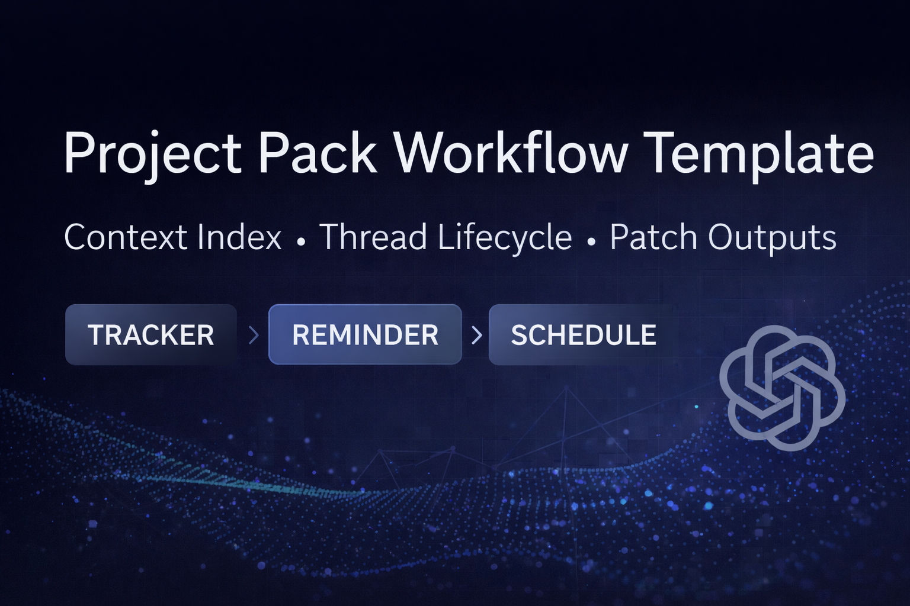

# llm-context-project-pack: A "Project Pack" workflow for using ChatGPT on real work (without leaking personal data)

This repo is a **public, sanitized template** of a system for working with ChatGPT using:

- A **Project Pack ZIP** as the single source of truth for context
- A **Context Index** that defines "what files exist" + "what each file owns"
- Lightweight **thread lifecycle rules** (when to start a new chat to avoid view limits)
- Self-maintaining **tracking + reminders + schedule patches** (no heavy extraction dependency)
- A weekly **compression & merge** maintenance prompt (optional)

It's designed to be:
- **Low clutter** (single-row trackers, no history logs)
- **Automation-light** (no external connectors required)
- **Easy to maintain** (weekly ZIP refresh)

> **Important:** This public repo includes **dummy/sample content only**.  
> Do **not** commit personal, medical, or sensitive information.

---

## Who is this for?

Anyone who uses ChatGPT for repeating workflows like:
- job search pipeline management (apply → outreach → interview prep)
- study planning
- personal routines
- "assistant-as-COO" planning

…and wants a **stable, reusable system** instead of ad-hoc prompt sprawl.

---

## How the Project Pack workflow works (at a glance)

This repo demonstrates a **Project Pack workflow** for using ChatGPT reliably on repeatable tasks.

At a high level:
- **Context lives outside the chat** in a Project Pack ZIP (Markdown files)
- A **Context Index** defines ownership and scope for each file
- Chats are **view-limit aware** and recommend new threads when needed
- Each interaction produces **deterministic patches** instead of free-form summaries:
  - `TRACKER PATCH → REMINDER PATCH → SCHEDULE PATCH`

This keeps state auditable, avoids long-chat failures, and reduces maintenance overhead.

For a deeper explanation and a talk track, see [`Diagram.md`](docs/Diagram.md).

---

## Repo layout

- `Context/` - runnable dummy Project Pack (recommended)
- `docs/architecture/` - how the system works
- `examples/` - sample files + example workflow
- `scripts/` - utilities (header bumping, validation, ZIP pack builder)
- `examples/sample_context_files/Context/` - dummy Project Pack content

---

## Quick start (template workflow)

1) Copy `Context/` directly into your own private repo. `examples/sample_context_files/Context/` is a duplicate copy. 
2) Edit `Context/System/Context_Index.md` to match your file inventory and ownership.
3) Use `scripts/build_project_pack.py` to create a Project Pack ZIP.
4) Upload the ZIP to a ChatGPT Project.
5) Paste a Project Instructions block from `Context/System/New_Chat_Start_Templates.md` into the Project instructions.
6) Work in lightweight chats. Let the system output:
   - `TRACKER PATCH → REMINDER PATCH → SCHEDULE PATCH`
7) End of day: "End of day" → calendar-ready export.

---

## Safety & privacy

- Keep private content private. Use this repo as a **template**.
- Prefer **placeholders** in public demos.
- If you want to share your system publicly: publish only architecture, examples, and scripts.

See: `docs/architecture/guardrails.md`

---

## License

MIT (see `LICENSE`).
